# 🚀 Allan Kelven - Full Stack Developer 🛠️

<div align="center">
  
</div>

<div align="center">
  
  
  
</div>

<div align="center">
  
  
</div>

---

## 🌟 Sobre Mim

```typescript
const allan: Developer = {
  name: "Allan Kelven",
  role: "Full Stack Developer",
  experience: "8+ anos",
  companies: ["Pethost (Founder)", "Meu Site BR (Founder)"],
  philosophy: "Ou você domina a IA, ou será dominado por ela",
  lifestyle: "Minimalista por essência",
  passion: "Criar soluções que impactam vidas",
  currentFocus: "Building the next generation of web applications"
};
```

- 🔭 **Atualmente:** Revolucionando o mercado pet com a **Pethost**
- 🌱 **Aprendendo:** IA aplicada a negócios e automação avançada  
- 💬 **Especialista em:** Java, React, Node.js, Python, Automação
- ⚡ **Filosofia:** *Código limpo, soluções escaláveis, resultados mensuráveis*
- 🎯 **Meta 2025:** Expandir a Pethost para todo o Brasil

---

## 🛠️ Arsenal Tecnológico

### 💻 **Frontend Universe**
<div align="center">
  
  
  
  
  
  
</div>

### 🔧 **Backend Powerhouse**
<div align="center">
  
  
  
  
  
</div>

### 🗄️ **Database Mastery**
<div align="center">
  
  
  
  
</div>

### 🚀 **DevOps & Tools**
<div align="center">
  
  
  
  
</div>

---

## 🎯 Especializações

<div align="center">

| 🤖 **Automação** | 🛍️ **E-commerce** | 🐾 **Pet Services** | 🏗️ **Arquitetura** |
|:---:|:---:|:---:|:---:|
| WhatsApp API | WordPress | Plataformas Pet | Microserviços |
| Power Automate | WooCommerce | Hospedagem | Clean Architecture |
| Bot Development | Payment Gateways | Gestão | API Design |
| Process Optimization | Inventory Systems | Automação | Scalable Solutions |

</div>

---

## 🚀 Projetos em Destaque

### 🐾 **[Pethost](https://github.com/co-finampy/pethost-web.git)** - *Revolução Pet*
> Plataforma completa de hospedagem para pets com tecnologia de ponta

**🎯 Impacto:** 500+ usuários ativos | **⚡ Performance:** 40% melhoria | **🔒 Segurança:** 99.9% uptime

```bash
# Stack Principal
Frontend: Next.js + React + TypeScript
Backend: Spring Boot + Java
Database: MongoDB
Auth: JWT + OAuth
```

### 📦 **[Pedego API](https://github.com/allankdev/pedego-api.git)** - *Sistema de Entregas*
> API escalável processando milhares de pedidos diariamente

**📊 Métricas:** 1000+ pedidos/dia | **🚀 Performance:** 99.5% confiabilidade | **⚡ Speed:** 40% redução latência

### 👨‍💼 **[HR Contábil](https://github.com/allankdev/hr-contabil.git)** - *Gestão Inteligente*
> Sistema completo de RH para empresas contábeis

**✨ Features:** Folha de pagamento automatizada, relatórios inteligentes, gestão completa

### 🤖 **[Bot SMS Telegram](https://github.com/allankdev/botsms.git)** - *Automação 4.0*
> Bot inteligente com integração SMS e múltiplos provedores

**🎯 Resultado:** 60% redução comunicação manual | **🔄 Automação:** 200+ interações/dia

---

## 📊 Estatísticas GitHub

<div align="center">
  
</div>

<div align="center">
  
</div>

---

## 🏆 Conquistas & Certificações

<div align="center">

| 🎓 **Certificação** | 🏢 **Instituição** | 📅 **Ano** |
|:---|:---:|:---:|
| Spring Boot Expert | Udemy | 2024 |
| MongoDB & NoSQL | Udemy | 2024 |
| Clean Code na Prática | Udemy | 2024 |
| Scrum Foundation | CertiProf | 2024 |
| Pré-MBA em IA | EXAME | 2024 |
| NLW Unite Fullstack | Rocketseat | 2024 |

</div>

---

## 📈 Jornada Profissional

```mermaid
timeline
    title Minha Evolução Tech
    2017 : Fundação Meu Site BR
         : Primeiros passos no desenvolvimento
    2019 : Especialização WordPress
         : Foco em e-commerce
    2021 : Migração para Full Stack
         : Java + React mastery
    2024 : Fundação Pethost
         : Revolução no mercado pet
    2025 : Expansão nacional
         : IA + Automação avançada
```



---

## 🌟 Filosofia de Código

> ### *"Código não é apenas instrução para máquinas, é arte para humanos interpretarem"*

```javascript
class DeveloperPhilosophy {
  constructor() {
    this.principles = [
      "Clean Code sempre",
      "Testes são obrigatórios", 
      "Performance é prioridade",
      "User Experience acima de tudo",
      "Aprender nunca é demais"
    ];
  }
  
  codeWithPassion() {
    return "Every line of code is a step towards innovation";
  }
}
```

---

## 🎮 Mini Game: Snake 🐍

<details>
<summary>🎯 Clique para jogar o Snake Game!</summary>

```html
<div align="center">
  <canvas id="gameCanvas" width="400" height="400" style="border: 2px solid #00e0ff; background: #0d0d0d;"></canvas>
  
  <script>
    const canvas = document.getElementById('gameCanvas');
    const ctx = canvas.getContext('2d');
    const box = 20;
    
    let snake = [{x: 9 * box, y: 9 * box}];
    let direction;
    let food = {
      x: Math.floor(Math.random() * 19 + 1) * box,
      y: Math.floor(Math.random() * 19 + 1) * box
    };
    let score = 0;
    
    document.addEventListener('keydown', setDirection);
    
    function setDirection(event) {
      if(event.keyCode == 37 && direction != 'RIGHT') direction = 'LEFT';
      if(event.keyCode == 38 && direction != 'DOWN') direction = 'UP';
      if(event.keyCode == 39 && direction != 'LEFT') direction = 'RIGHT';
      if(event.keyCode == 40 && direction != 'UP') direction = 'DOWN';
    }
    
    function draw() {
      ctx.fillStyle = '#0d0d0d';
      ctx.fillRect(0, 0, 400, 400);
      
      for(let i = 0; i < snake.length; i++) {
        ctx.fillStyle = (i == 0) ? '#00e0ff' : '#c3c3c3';
        ctx.fillRect(snake[i].x, snake[i].y, box, box);
        ctx.strokeStyle = '#000';
        ctx.strokeRect(snake[i].x, snake[i].y, box, box);
      }
      
      ctx.fillStyle = '#ff0000';
      ctx.fillRect(food.x, food.y, box, box);
      
      let snakeX = snake[0].x;
      let snakeY = snake[0].y;
      
      if(direction == 'LEFT') snakeX -= box;
      if(direction == 'UP') snakeY -= box;
      if(direction == 'RIGHT') snakeX += box;
      if(direction == 'DOWN') snakeY += box;
      
      if(snakeX == food.x && snakeY == food.y) {
        score++;
        food = {
          x: Math.floor(Math.random() * 19 + 1) * box,
          y: Math.floor(Math.random() * 19 + 1) * box
        };
      } else {
        snake.pop();
      }
      
      let newHead = {x: snakeX, y: snakeY};
      
      if(snakeX < 0 || snakeY < 0 || snakeX >= 400 || snakeY >= 400 || collision(newHead, snake)) {
        clearInterval(game);
        alert('Game Over! Score: ' + score);
      }
      
      snake.unshift(newHead);
      
      ctx.fillStyle = '#00e0ff';
      ctx.font = '20px Arial';
      ctx.fillText('Score: ' + score, 10, 30);
    }
    
    function collision(head, array) {
      for(let i = 0; i < array.length; i++) {
        if(head.x == array[i].x && head.y == array[i].y) {
          return true;
        }
      }
      return false;
    }
    
    let game = setInterval(draw, 100);
  </script>
</div>

**Como jogar:** Use as setas do teclado ⬅️➡️⬆️⬇️
```

</details>

---

## 🌐 Conecte-se Comigo

<div align="center">
  <a href="https://instagram.com/kelvenallan" target="_blank">
    
  </a>
  <a href="mailto:allankelven.ak@gmail.com">
    
  </a>
  <a href="https://www.linkedin.com/in/allankelven" target="_blank">
    
  </a>
  <a href="https://discord.com/users/allankelven92" target="_blank">
    
  </a>
  <a href="https://allan-kelven.vercel.app/" target="_blank">
    
  </a>
</div>

---

## 💡 Quote que me Move

<div align="center">
  
  
  
</div>

---

<div align="center">
  
</div>

<div align="center">
  
</div>

---

### ⭐ Se você chegou até aqui, considere dar uma estrela nos meus projetos! ⭐
